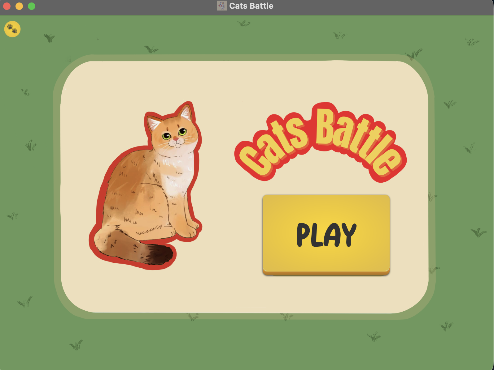
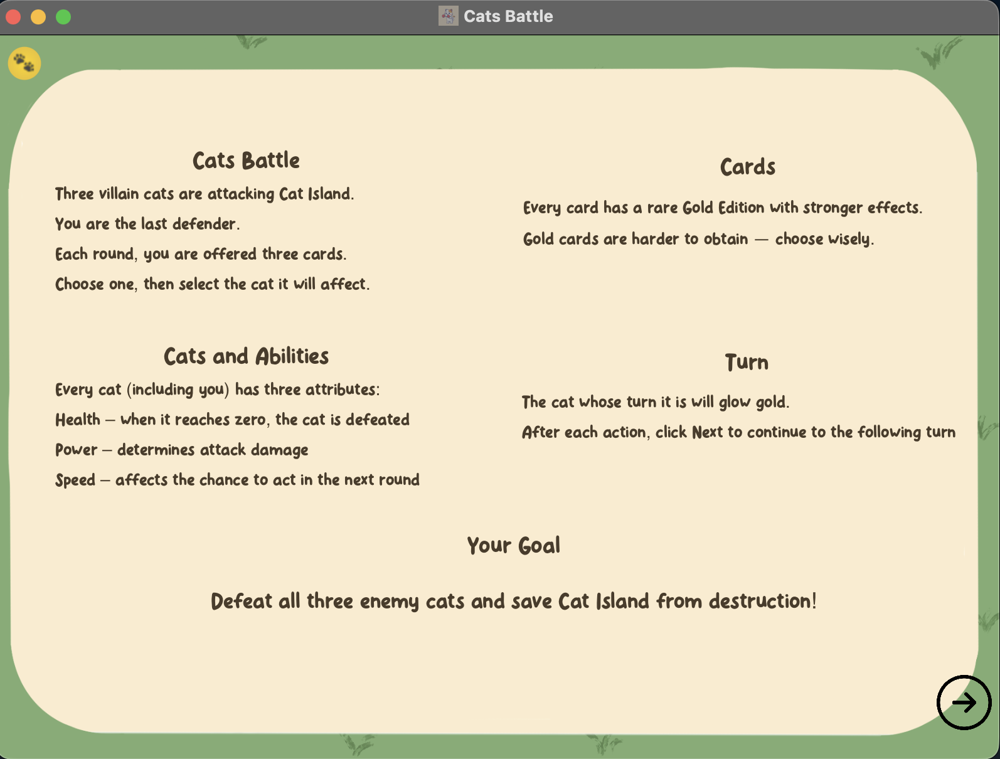
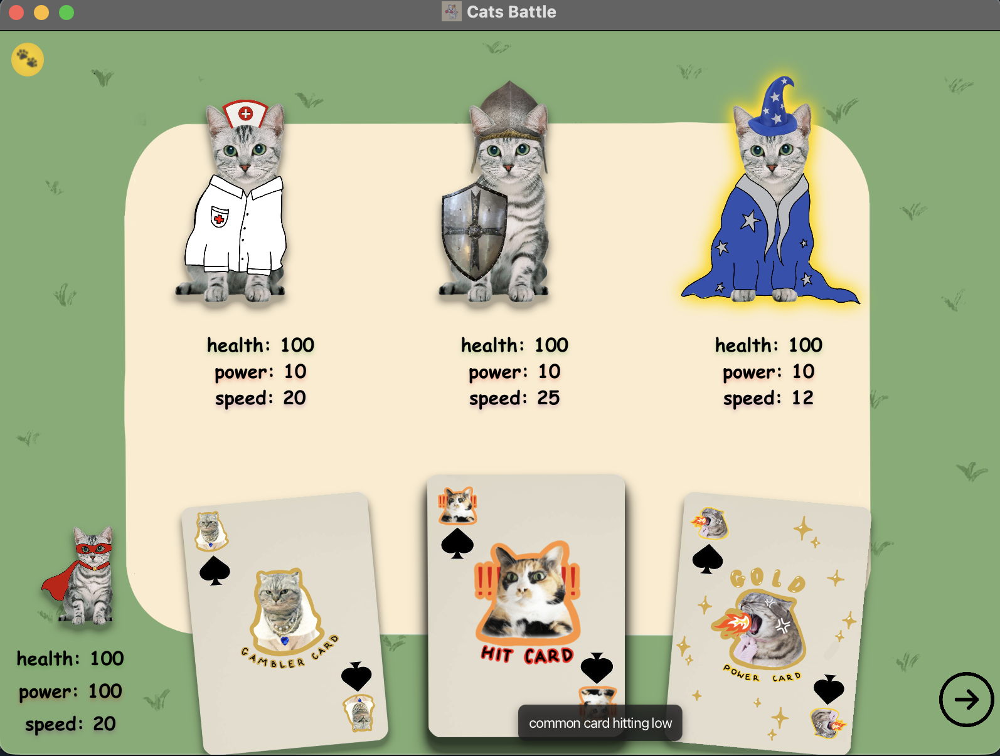
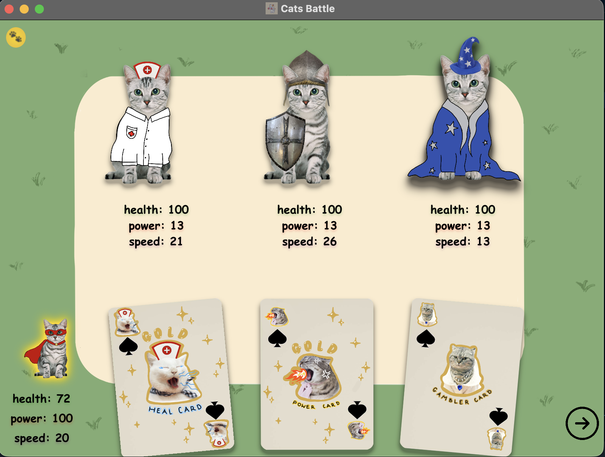

<h1 align="center">🐱 CATS BATTLE 🐱</h1>

<p align="center">
A turn-based strategy card-game where heroic cat face off against enemies
</p>

## 📦 1. Build

### Requirements

* **JavaFX**: version **25.x**
* **Java (JDK)**: version **25**
* **g++**: minimum version **7.0**

---

### macOS and Linux Setup

1. Paste the location of your **JavaFX/lib** folder into `JAVAFX_PATH` in:

   * `run.sh`
   * `unittests/test2.sh`
   * `.vscode/settings.json`

2. Make scripts executable:

```bash
chmod +x run.sh unittests/test2.sh unittests/test.sh
```

---

## ▶️ 2. Run Game

### Start the game

```bash
./run.sh
```

### Run unit tests

**C++ tests**

```bash
./unittests/test.sh
```

**Java tests**

```bash
./unittests/test2.sh
```

---

## 🎮 3. Gameplay

1. Start the game using **Play**



2. Carefully read the game explanation and click the arrow in the bottom-right corner



3. After each round (including enemy rounds), click the arrow to proceed




4. Close the game using the **yellow button** or the standard **macOS close window** button

---

## ⚙️ 4. How Does the Game Work?

### 🧠 C++ (Game Logic)

* Generates **enemies**, **hero**, and **cards** with their statistics
* Determines whose turn based on players **speed** (probability)
* Executes picked turn:

  * **Hero** – initializes cards based on their probability and waits for input via `.txt` files
  * **Healer** – heals enemies
  * **Warrior** – attacks the hero
  * **Wizard** – boosts enemy abilities
* Checks if any character has died and whether the game is over
* Writes statistics to `.txt` files and waits until they are cleared
* Cycles back to picking whose turn


### 🎨 Java (UI & Control Layer)

* JavaFX builds the **starting menu**, **rules screen**, **maingame screen** and **end screen** using `.fxml` files
* Launches the compiled **C++ process**
* Waits for files to be ready and safely refreshes the UI (multithreading handled correctly)
* During the hero's turn:

  * Refreshes cards
  * Detects which **cat** and **card** were clicked
  * Sends player choices to `.txt` files

---

## ✅ 5. Project Requirements — **120 / 120 Points**

### General

* **Presentation** – 20 pt  
  (Clear presentation, working program, no errors, proper exit handling)
* **Project defense** – 20 pt  
  (Answering questions, explaining the code)
* **Coding style** – 5 pt  
  (Consistent style, no random comments)
* **Code split into multiple files** – 5 pt  
  (`.h/.hpp`, `.cpp`, `.java`, proper package naming)
* **Version control system** – 10 pt  
  (Git, SVN, etc.)

---

### C++ Requirements

* Dynamic allocation – 2 pt
* One main program class – 2 pt
* Constructor – 1 pt
* Destructor – 1 pt
* Encapsulation – 1 pt
* Inheritance – 2 pt
* Virtual method – 1 pt
* Polymorphism – 7 pt
* Operator overloading – 1 pt
* Enumeration (`enum class`) – 1 pt
* File I/O (`<fstream>`) – 1 pt
* STL algorithms – 1 pt
* Error handling – 2 pt
* Generic programming (templates) – 3 pt
* Unit tests – 3 pt
* Parallel programming (`std::thread`) – 3 pt

---

### Java Requirements

* Constructor – 1 pt
* Destructor (resource cleanup) – 1 pt
* Encapsulation – 1 pt
* Inheritance – 2 pt
* Interface / abstract class – 1 pt
* Overridden method (`@Override`) – 1 pt
* Polymorphism – 7 pt
* Enumeration – 1 pt
* File I/O – 1 pt
* Collections – 1 pt
* Error handling – 2 pt
* Generics – 3 pt
* Unit tests – 3 pt
* Parallel programming – 3 pt

---
